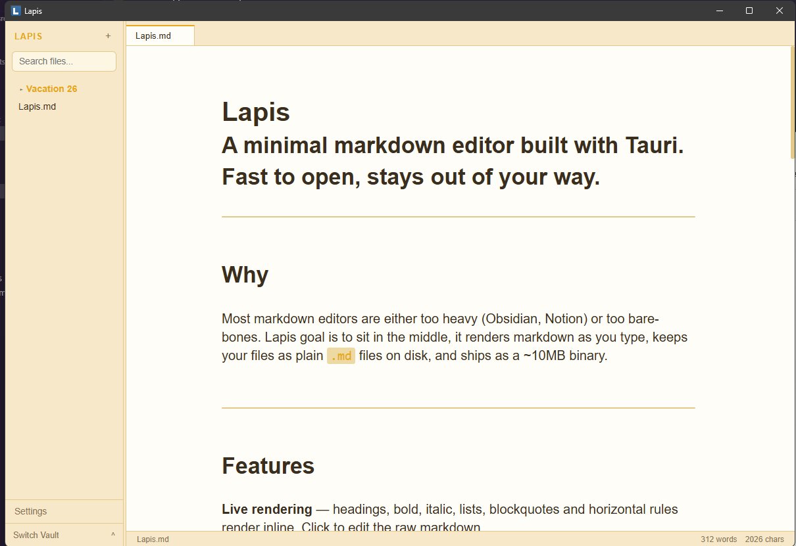
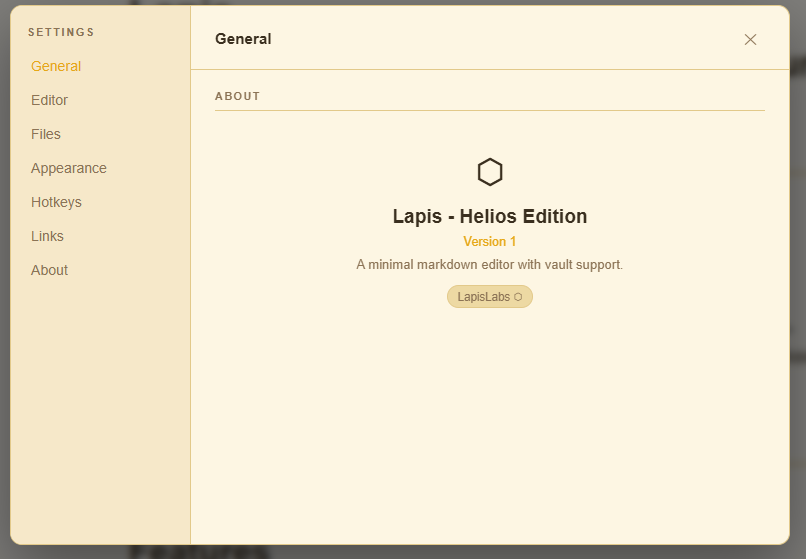

<p align="center">
  
</p>


A minimal markdown editor built with Tauri. Fast to open, stays out of your way.
---

## Why

Most markdown editors are either too heavy (Obsidian, Notion) or too bare-bones. Lapis goal is to sit in the middle, it renders markdown as you type, keeps your files as plain `.md` files on disk, and ships as a ~10MB binary.

---

## Features

- **Live rendering** — headings, bold, italic, lists, blockquotes and horizontal rules render inline. Click to edit the raw markdown.
- **Vaults** — a vault is just a folder. Open any folder, Lapis tracks it.
- **Tabs** — open multiple files, tabs reopen on next launch.
- **Command palette** — `Ctrl+P` to open files, `>` to run commands.
- **Themes** — dark, light, sepia, high contrast. Custom themes via JSON in your vault.
- **Resizable sidebar** — drag the edge, it remembers the width.
- **Status bar** — word count and character count as you write.

---

## Shortcuts

| | |
|---|---|
| `Ctrl+P` | Command palette |
| `Ctrl+N` | New file |
| `Ctrl+W` | Close tab |
| `Ctrl+Tab` | Next tab |
| `Ctrl+Shift+Tab` | Previous tab |

---

## Getting started

You'll need [Rust](https://rustup.rs/) and Node.js installed.

```bash
git clone https://github.com/wklnd/lapis
cd lapis
npm install
npm run tauri dev
```

To build a release binary:

```bash
npm run tauri build
```

Output lands in `src-tauri/target/release/bundle/`.

---

## Screenshots

<p align="center">
  
</p>

<p align="center">
  
</p>

## Custom themes

Drop a `.json` file into `.lapis/themes/` inside your vault:

```json
{
  "name": "My Theme",
  "colors": {
    "bg-primary":   "#1a1a2e",
    "bg-secondary": "#12121f",
    "bg-tertiary":  "#15152a",
    "bg-editor":    "#1e1e1e",
    "text-primary": "#d4d4d4",
    "text-muted":   "#666666",
    "accent":       "#a78bfa",
    "border":       "#2a2a3e",
    "sidebar-bg":   "#12121f"
  }
}
```

Or create one from Settings inside the app.

---
### Macros

Type any macro in the editor and it expands automatically when the closing `}}` is completed.

| Macro | Example output | Description |
|---|---|---|
| `{{DATE}}` | `2026-03-03` | Today's date in ISO format |
| `{{DATE_SHORT}}` | `03/03/2026` | Date as DD/MM/YYYY |
| `{{DATE_LONG}}` | `Monday, March 3 2026` | Full human-readable date |
| `{{TIME}}` | `14:22` | Current time (HH:MM) |
| `{{TIME_FULL}}` | `14:22:09` | Current time with seconds |
| `{{DATETIME}}` | `2026-03-03 14:22` | Date and time combined |
| `{{TIMESTAMP}}` | `1741006920` | Unix timestamp in seconds |
| `{{WEEKDAY}}` | `Monday` | Full name of the current day |
| `{{WEEKDAY_SHORT}}` | `Mon` | Abbreviated day name |
| `{{WEEK}}` | `10` | ISO week number of the year |
| `{{MONTH}}` | `March` | Full name of the current month |
| `{{MONTH_SHORT}}` | `Mar` | Abbreviated month name |
| `{{MONTH_NUM}}` | `03` | Month as a zero-padded number |
| `{{YEAR}}` | `2026` | Current four-digit year |
| `{{YEAR_SHORT}}` | `26` | Current two-digit year |
| `{{DAY}}` | `03` | Day of the month, zero-padded |
| `{{UUID}}` | `a1b2c3d4-...` | Random UUID v4 |
| `{{RANDOM}}` | `4271` | Random integer between 0 and 9999 |

## Stack

- [Tauri 2](https://tauri.app/) — native shell, no Electron
- [CodeMirror 6](https://codemirror.net/) — editor
- Vanilla JS + Vite — no framework

---

## License

Source-available — see LICENSE.md for details.
